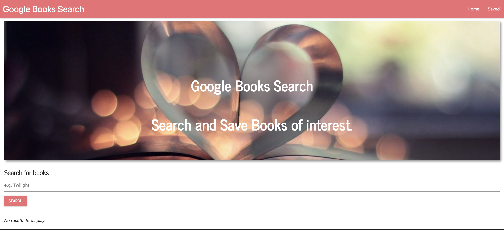

## Badges

## Description:
An application created using the MERN stack and allows users to search for books via the Google Books API. Search results are dynamically rendered in the UI and users have the option to save and/or delete books. Users are notified of saving or deleting books from the db using Socket.io.

## Technologies:
- Bootstrap
- Node.js
- React
- React-Dom
- Materialize
- Axios
- ExpressJS
- Mongoose
- MongoDB
- jQuery

## Table of Contents
* [Description](#description)
* [Technologies](#topics)
* [Installation](#installation)
* [Usage](#usage)
* [Contributing](#contributing)
* [Test](#test)
* [Challenges](#challenges)
* [Questions](#questions)
* [License](#license)
* [Author](#Author)
* [Badges](#badges)

## Installation
Before installing this application on your local computer, ensure that you have Node, NPM and MongoDB installed globally on your machine. This application works in Node. You can go to the following website to download Node: <a href='https://nodejs.org/en/'>Node</a>

This is a react act application.

Installation:

    - clone the repo or download the zip file to your local machine
    - open repo in vscode or text editor of choice
    - npm install

To Start Server:

    - npm start

To Visit App:

    - localhost:3000

## How It Works
    1. Users are first directed to the Home page where they can search for any book. Book information 
    is retrived via the publicly available Google Books API.

    2. Upon searching for a book, users will see a list of relevant results. They can click save to save 
    the book to the Saved page. In the back end, the book is saved to the Mongo database.

    3. Users can save as many books as they want. If they then go to the Saved page, they'll not only see 
    books that have been saved by them, but also previous visitor's saved books.

    4. Upon clicking the save button, users will be notified that they saved a book with the title to the DB.

    5. In either the Home or Saved pages, a user can click on the View Book button. This will redirect them to 
    the Google Books store page where they can either purchase or read a preview of the book.

    6. If a user wants to remove a saved book from the list, they may click the Delete button to remove the book 
    from the page. In the back end, this deletes the document from the Mongo database.

    7. Upon clicking the delete button, users will be notified that they delete the book with the title of the DB.

## Contributors
This application is open to anyone who wants to contribute or enhance the application. If you would like to contribute please reach out to me on Github or email.

## Test
Launches the test runner in the interactive watch mode.\
See the section about [running tests](https://facebook.github.io/create-react-app/docs/running-tests) for more information.

## Challenges
Wheww, this was a challenging build for sure. I use the boilerplate that was provided of course but still needed to add other technologies to make it functional.

I found it diffult trying to manipulate the components to create the different aspects of the application. I added a new technology that I have not used before Msterialize to create ham menu and sidenav bar from the ham menu. That took some time and some research because I tried everything but still was not working. I was able to stumble upon a Medium post that gave me clear understanding on how to integrate Materialize into react and use it properly.

The other difficulty I ran into was creating notification for the user using socket.io. This was another thing I was really not too familiar with but wanted to challenge myself. I did research on the different variation on how to use it and create the notification. I would say It was definitely worth the time it took accomplish the thing I wanted.

I would say utilizing all my knowledge and tools that I have garnered in the UW Full Stack Web Development program made the build all that much amazing to know that I am capable and can do so much more. 

## Questions
If you have questions about this repository? Please contact me at [kamara.moses@yahoo.com](mailto:kamara.moses@yahoo.com). View more of my work in GitHub at [kamara-moses](https://github.com/kamara-moses).

## License
This repository is licensed under the MIT license.

Copyright (c) [2020] [Moses Kamara]

Permission is hereby granted, free of charge, to any person obtaining a copy of this software and associated documentation files (the 'Software'), to deal in the Software without restriction, including without limitation the rights to use, copy, modify, merge, publish, distribute, sublicense, and/or sell copies of the Software, and to permit persons to whom the Software is furnished to do so, subject to the following conditions:

The above copyright notice and this permission notice shall be included in all copies or substantial portions of the Software.

THE SOFTWARE IS PROVIDED 'AS IS', WITHOUT WARRANTY OF ANY KIND, EXPRESS OR IMPLIED, INCLUDING BUT NOT LIMITED TO THE WARRANTIES OF MERCHANTABILITY, FITNESS FOR A PARTICULAR PURPOSE AND NONINFRINGEMENT. IN NO EVENT SHALL THE AUTHORS OR COPYRIGHT HOLDERS BE LIABLE FOR ANY CLAIM, DAMAGES OR OTHER LIABILITY, WHETHER IN AN ACTION OF CONTRACT, TORT OR OTHERWISE, ARISING FROM, OUT OF OR IN CONNECTION WITH THE SOFTWARE OR THE USE OR OTHER DEALINGS IN THE SOFTWARE.

## Author 

